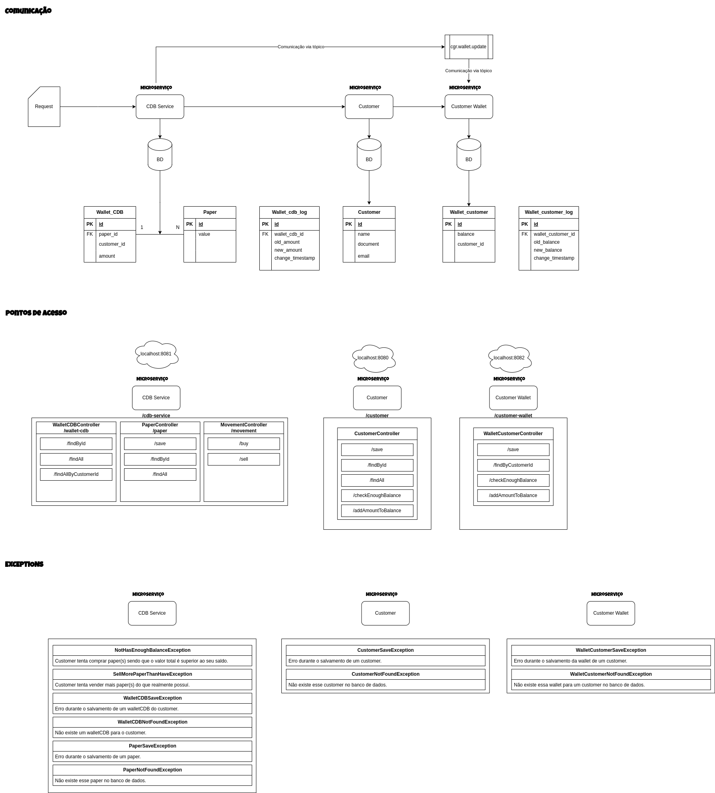

# CDB-microservices

Conjunto de microserviços para um fluxo de compra e venda de cdb.


## Demonstração do fluxo dos micro serviços




## Stack utilizada

Maven, Docker, Java 17, Spring boot, PostgreSQL, H2, Kafka.


## Documentação do cdb-service

## WalletCDBController

#### Retorna um walletCDB de acordo com seu id

```http
  GET /cdb-service/wallet-cdb/findById
```

| Parâmetro   | Tipo       | Descrição                                   |
| :---------- | :--------- | :------------------------------------------ |
| `id`      | `Long` | **Obrigatório**. O ID do walletCDB |


#### Retorna todos os walletCDB cadastrados no banco

```http
  GET /cdb-service/wallet-cdb/findAll
```

#### Retorna todos os walletCDB de um determinado customer

```http
  GET /cdb-service/wallet-cdb/findAllByCustomerId
```

| Parâmetro   | Tipo       | Descrição                                   |
| :---------- | :--------- | :------------------------------------------ |
| `customerId`      | `Long` | **Obrigatório**. ID do customer |

## PaperController

#### Salva um paper no banco de dados

```http
  POST /cdb-service/paper/save
```

| Parâmetro   | Tipo       | Descrição                                   |
| :---------- | :--------- | :------------------------------------------ |
| `paperDTO`      | `PaperDTO` | **Obrigatório**. DTO do paper a ser salvo |

#### Retorna um paper de acordo com seu id

```http
  GET /cdb-service/paper/findById
```

| Parâmetro   | Tipo       | Descrição                                   |
| :---------- | :--------- | :------------------------------------------ |
| `id`      | `Long` | **Obrigatório**. ID do paper |


#### Retorna todos os papers cadastrados no banco

```http
  GET /cdb-service/paper/findAll
```

## MovementController


#### Compra paper(s) para um customer

```http
  GET /cdb-service/movement/buy
```

| Parâmetro   | Tipo       | Descrição                                   |
| :---------- | :--------- | :------------------------------------------ |
| `customerId`      | `Long` | **Obrigatório**. ID do customer |
| `paperId`      | `Long` | **Obrigatório**. ID do paper |
| `amount`      | `BigDecimal` | **Obrigatório**. Quantidade desse paper que ele deseja comprar |

#### Vende paper(s) de um customer

```http
  GET /cdb-service/movement/sell
```

| Parâmetro   | Tipo       | Descrição                                   |
| :---------- | :--------- | :------------------------------------------ |
| `customerId`      | `Long` | **Obrigatório**. ID do customer |
| `paperId`      | `Long` | **Obrigatório**. ID do paper |
| `amount`      | `BigDecimal` | **Obrigatório**. Quantidade desse paper que ele deseja vender |

## Documentação do customer

## CustomerController

#### Salva um customer no banco de dados

```http
  POST /customer/save
```

| Parâmetro   | Tipo       | Descrição                                   |
| :---------- | :--------- | :------------------------------------------ |
| `customerDTO`      | `CustomerDTO` | **Obrigatório**. DTO do customer a ser salvo |

#### Verifica um customer tem saldo suficiente

```http
  GET /customer/checkEnoughBalance
```

| Parâmetro   | Tipo       | Descrição                                   |
| :---------- | :--------- | :------------------------------------------ |
| `customerId`      | `Long` | **Obrigatório**. ID do customer |
| `amount`      | `BigDecimal` | **Obrigatório**. Valor a ser verificado |

#### Adiciona um valor a um saldo de um customer

```http
  GET /customer/addAmountToBalance
```

| Parâmetro   | Tipo       | Descrição                                   |
| :---------- | :--------- | :------------------------------------------ |
| `customerId`      | `Long` | **Obrigatório**. ID do customer |
| `amount`      | `BigDecimal` | **Obrigatório**. Valor a ser adicionado |

#### Retorna um customer de acordo com seu id

```http
  GET /customer/findById
```

| Parâmetro   | Tipo       | Descrição                                   |
| :---------- | :--------- | :------------------------------------------ |
| `id`      | `Long` | **Obrigatório**. ID do customer |

#### Retorna todos os customers cadastrados no banco

```http
  GET /customer/findAll
```

## Documentação do customer-wallet

## WalletCustomerController

#### Salva um walletCustomer no banco de dados

```http
  POST /customer-wallet/save
```

| Parâmetro   | Tipo       | Descrição                                   |
| :---------- | :--------- | :------------------------------------------ |
| `walletCustomerDTO`      | `WalletCustomerDTO` | **Obrigatório**. DTO do walletCustomer a ser salvo |

#### Verifica um customer tem saldo suficiente

```http
  GET /customer-wallet/checkEnoughBalance
```

| Parâmetro   | Tipo       | Descrição                                   |
| :---------- | :--------- | :------------------------------------------ |
| `customerId`      | `Long` | **Obrigatório**. ID do customer |
| `amount`      | `BigDecimal` | **Obrigatório**. Valor a ser verificado |

#### Adiciona um valor a um saldo de um customer

```http
  GET /customer-wallet/addAmountToBalance
```

| Parâmetro   | Tipo       | Descrição                                   |
| :---------- | :--------- | :------------------------------------------ |
| `customerId`      | `Long` | **Obrigatório**. ID do customer |
| `amount`      | `BigDecimal` | **Obrigatório**. Valor a ser adicionado |

#### Retorna o walletCustomer de um determinado customer

```http
  GET /customer-wallet/findByCustomerId
```

| Parâmetro   | Tipo       | Descrição                                   |
| :---------- | :--------- | :------------------------------------------ |
| `customerId`      | `Long` | **Obrigatório**. ID do customer |